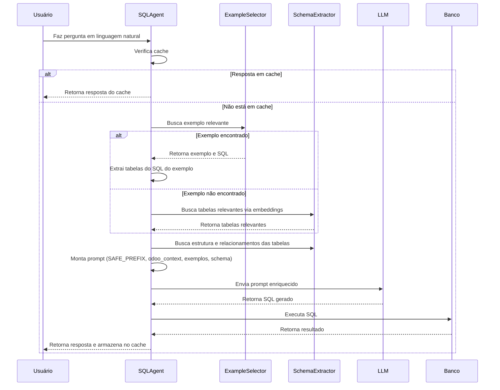

# Documentação do Fluxo do SQL Agent Odoo

## 1. Visão Geral

Este agente utiliza LLMs para converter perguntas em linguagem natural sobre bancos de dados Odoo em consultas SQL, enriquecendo o contexto com exemplos few-shot, informações do schema e instruções de segurança.

---

## 2. Componentes-Chave

- **SAFE_PREFIX**:  
  Um prefixo de segurança importado do arquivo `prompts.py`, adicionado ao prompt do agente para garantir que as respostas estejam alinhadas com as diretrizes de segurança e contexto do negócio.

- **odoo_context**:  
  Bloco de contexto específico do Odoo, injetado no prompt para orientar o LLM sobre as particularidades do modelo de dados Odoo (ex: relações entre tabelas, campos comuns, fluxos de negócio).

- **example_selector**:  
  Um seletor semântico (`SemanticSimilarityExampleSelector`) que busca exemplos relevantes de perguntas e SQL corretos, persistidos em um vector store Chroma. Se um exemplo similar for encontrado, ele é priorizado no prompt para guiar a geração do SQL.

---

## 3. Fluxo das Funções

### 1. **Usuário faz uma pergunta**
   - Exemplo:  
     _"Quais clientes compraram mais de R$ 10.000 no último mês?"_

### 2. **Verificação de Cache**
   - Se a pergunta já foi respondida antes, retorna o resultado do cache.

### 3. **Seleção de Exemplo (Few-Shot)**
   - O `example_selector` busca o exemplo mais similar à pergunta.
   - Se encontrado, extrai as tabelas do SQL do exemplo.

### 4. **Busca de Tabelas Relevantes**
   - Se não houver exemplo, utiliza busca vetorial no schema para encontrar as tabelas mais relevantes para a pergunta.

### 5. **Construção do Prompt Enriquecido**
   - Monta um prompt com:
     - SAFE_PREFIX
     - odoo_context
     - Estruturas das tabelas relevantes
     - Relacionamentos entre as tabelas
     - Amostras de dados (se disponíveis)
     - Exemplo few-shot (se houver)
     - Pergunta do usuário

### 6. **Execução do Agente**
   - O agente (`create_sql_agent`) recebe o prompt e gera a consulta SQL.

### 7. **Execução da Query e Resposta**
   - A query SQL é executada no banco.
   - O resultado é retornado ao usuário e armazenado em cache.

---

## 4. Visualização do Fluxo

### 4.1. Diagrama de Sequência UML (Mermaid)



---

### 4.2. Infográfico Textual

---

## 5. Exemplo de Fluxo

```mermaid
flowchart TD
    A[Usuário faz pergunta] --> B{Cache?}
    B -- Sim --> Z[Retorna resposta do cache]
    B -- Não --> C[Seleciona exemplo relevante (example_selector)]
    C -- Exemplo encontrado --> D[Extrai tabelas do SQL do exemplo]
    C -- Não encontrado --> E[Busca tabelas relevantes no schema]
    D & E --> F[Constrói prompt enriquecido]
    F --> G[Executa agente LLM]
    G --> H[Executa SQL no banco]
    H --> I[Retorna resposta ao usuário e armazena no cache]
```

---

## 6. Exemplo Prático

**Pergunta do Usuário:**  
_"Quais clientes compraram mais de R$ 10.000 no último mês?"_

**Fluxo:**
1. Busca exemplo similar:  
   - Exemplo encontrado:  
     Pergunta: "Clientes com compras acima de R$ 5.000 no mês passado"  
     SQL:  
     ```sql
     SELECT rp.name, SUM(so.amount_total) as total
     FROM sale_order so
     JOIN res_partner rp ON so.partner_id = rp.id
     WHERE so.date_order >= '2023-05-01' AND so.date_order < '2023-06-01'
     GROUP BY rp.name
     HAVING SUM(so.amount_total) > 5000
     ```
2. Extrai tabelas: `sale_order`, `res_partner`
3. Busca estrutura e relacionamentos dessas tabelas
4. Monta prompt com SAFE_PREFIX, odoo_context, exemplo, estruturas, relacionamentos, amostras
5. Agente gera SQL adaptado para R$ 10.000 e o mês correto
6. Executa SQL e retorna resposta

---

## 7. Sugestões de Melhoria

- **Atualização automática dos exemplos few-shot**: Monitorar mudanças no arquivo de exemplos e atualizar o vector store automaticamente.
- **Divisão do código**: O arquivo `sql_agent.py` está extenso; recomenda-se dividir em módulos menores (ex: `schema_extractor.py`, `prompt_builder.py`, `example_selector.py`).
- **Visualização interativa**: Implementar um dashboard para visualizar o fluxo das queries e exemplos utilizados.
- **Testes automatizados**: Cobrir os fluxos principais com testes unitários e de integração.

---

## 8. Considerações de Escalabilidade e Manutenibilidade

O fluxo atual é robusto e modular, mas o tamanho do arquivo principal pode dificultar a manutenção a longo prazo. A separação de responsabilidades em arquivos menores e a documentação clara dos fluxos e pontos de extensão facilitarão a evolução do sistema. O uso de exemplos few-shot persistidos e busca vetorial garante escalabilidade para múltiplos domínios e bancos, desde que o processo de atualização dos embeddings seja bem gerenciado.

---
